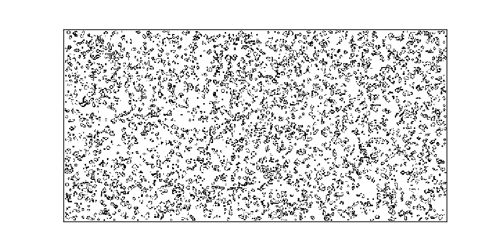

<!--
 * @Author: your name
 * @Date: 2021-03-05 15:55:22
 * @LastEditTime: 2021-03-05 16:11:57
 * @LastEditors: Please set LastEditors
 * @Description: In User Settings Edit
 * @FilePath: /projects/计算概论C/lifeGame/readme.md
-->
## Life Game by Python

Implementation of life game to showing for new students of __Introduction to Computing C__，in order to stimulate students' interest in the python language.

Just download and run with python3, be sure that you installed numpy and matplotlib. 
You can install these lib by pip3
``` sh
>>> pip3 install numpy
>>> pip3 install matplotlib
```

You will see those cell life cycle in the Matrix for 10 second.
